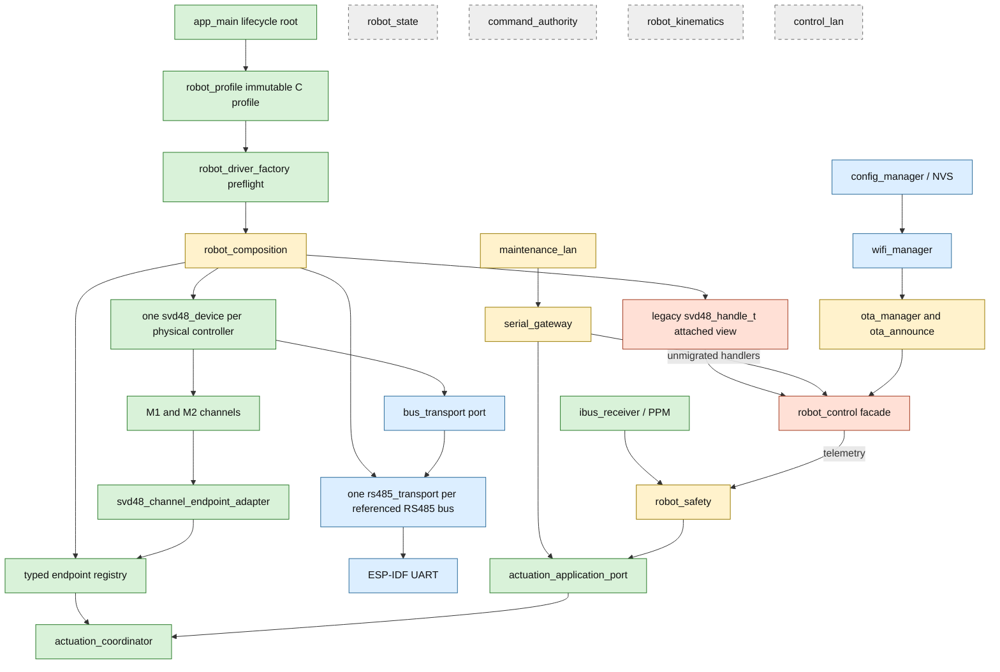
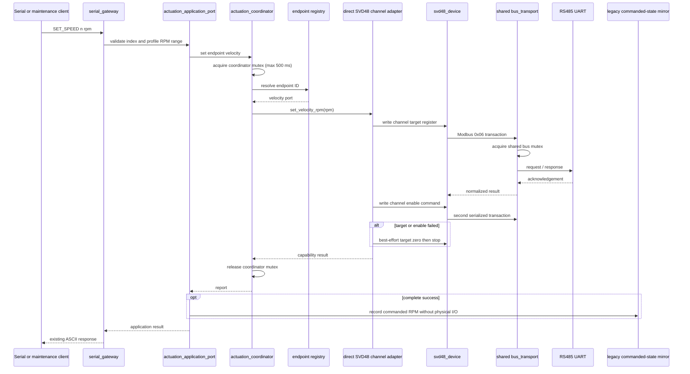
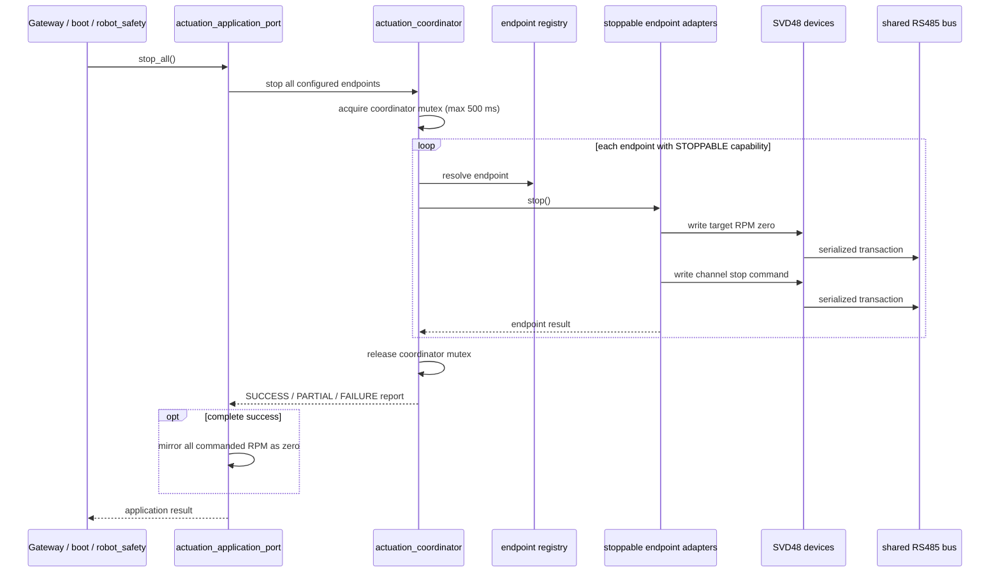
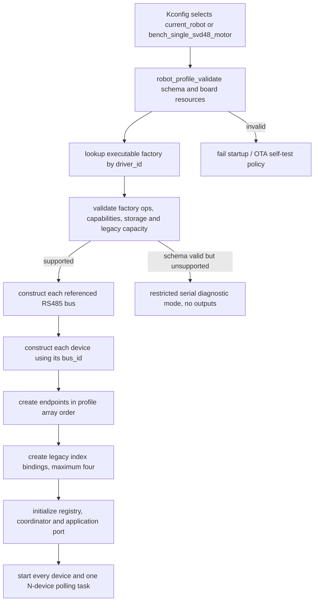
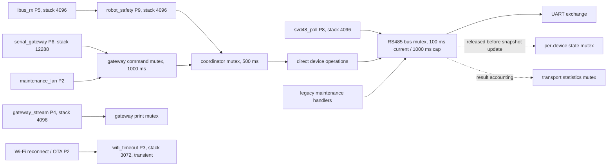

# Current architecture

## Scope and status

This document is the primary source for the architecture implemented by build 19 on
`refactor/svd48-device-composition` after Iteration 4. It is an as-built
description, not the target design. The target and migration rationale live in
[Architecture refactor](ARCHITECTURE_REFACTOR.md).

The firmware is bench-only. `app_main()` is the composition root; component-owned
FreeRTOS tasks perform runtime work after startup, and the main task sleeps. The
runtime topology comes from one immutable, build-selected C profile. There is no
JSON/YAML loader and the executable factory registry supports only SVD48.

## Components and dependencies

The active speed/stop adapter is the direct SVD48 channel adapter. The
`robot_control_endpoint_adapter` is retained only for host characterization and is
not wired by `robot_composition`. `serial_gateway` depends on the application port
and primitive diagnostic data; it does not depend on profile, composition or the
coordinator implementation.

## `SET_SPEED` sequence

The target and enable writes execute while the coordinator mutex is held. The bus
mutex separately serializes this device with polling, maintenance and other devices
on the same RS485 bus. Channel commands use the retries configured by the bus
profile; generic maintenance writes do not retry an ambiguous lost acknowledgement.

## `STOP ALL` sequence

`STOP n`, boot stop and safety stop use the same boundary. A boot-stop failure still
logs a warning and normal startup continues. The mutex prevents migrated operations
from interleaving, but it is not a priority-aware owner task: a safety stop may wait
up to 500 ms to acquire it and then behind the current bus transaction.

## Profile-driven construction

The executable registry declares byte capacity for runtime device slots, endpoint
capacity and the transitional legacy binding capacity. Preflight sums each factory's
`storage_required()` result with overflow checks. More than four compatibility
bindings produces `LEGACY_BINDING_LIMIT`; it is not an SVD48 device/channel limit.
The active SVD48 composition also rejects an empty endpoint set, zero or unsupported
capabilities, inverted limits, unschedulable periods and any velocity endpoint that
lacks `STOPPABLE`. These checks complete before a bus or device is constructed.

The SVD48 factory requires one dual-channel physical device and resolves its
transport by `device.bus_id`, never by array position. Because the legacy maintenance
API still identifies a controller only by Modbus address, repeated SVD48 addresses
across buses are rejected until that API carries bus/device identity.

The supported profiles are:

| Profile | RS485 topology | Endpoint topology | Geometry |
| --- | --- | --- | --- |
| `current_robot` | One referenced RS485 bus, devices at addresses 1 and 2 | Four endpoints ordered drive 1 M1/M2, drive 2 M1/M2 | Differential |
| `bench_single_svd48_motor` | One referenced RS485 bus, one device at address 1 | One endpoint at legacy index 0, channel M1 | None |

The bench profile does not invent a second controller. `SET_SPEED 0`, `STOP 0` and
`STOP ALL` are routable; index 1 is invalid and `MOVE_VEL` is unsupported because
there is no application geometry. Both profiles also declare a GPIO RC bus, which
`main` consumes separately from SVD48 composition.

## Polling, observations and health

One `svd48_poll_service` schedules every configured physical device. Position,
speed and current are read on every poll; status, motor temperature, bus voltage,
MOS temperature and error code are added every twentieth poll. A poll is:

- `OK` only when every observation scheduled for that poll succeeds;
- `PARTIAL` when at least one scheduled read succeeds and at least one fails;
- a concrete transport/protocol error when no scheduled read succeeds.

Each channel snapshot carries valid, failed and stale observation masks plus a
timestamp per observation. A success for current cannot update or clear speed. A
channel is `OFFLINE` when recent valid communication is absent, `FAULT` when a fresh
error-code observation is nonzero, `STALE` when an observation has expired or was
never valid, `DEGRADED` after an incomplete result with still-fresh prior data, and
`HEALTHY` only after a complete poll with all observations valid and fresh.

`PARTIAL` is a polling-service failure for backoff. Backoff never shortens the
device's nominal period and is scheduled from the instant that device's poll
finishes. Deadlines use explicit scheduled state and signed modular comparison, so a
wrapped deadline of zero is not confused with an uninitialized entry. A per-device
poll guard prevents the shared task and legacy `POLL_ONCE` from interleaving cycles;
the concurrent request receives `BUS_BUSY` without advancing the poll cycle.

The manufacturer contract names given speed (`0x5304/0x5305`) and observed motor
speed (`0x5410/0x5411`) as RPM. The driver preserves the signed raw register value
without a factor-of-ten conversion. That raw observation already feeds the legacy
5-RPM readiness gate for OTA/maintenance and the motion state reported by
`PLATFORM_STATUS` when it is online and fresh. It is not independent evidence that
the physical axis moved; controlled physical qualification and a reviewed fail-safe
policy remain required.

## Tasks and locks

The coordinator mutex is acquired before a migrated device call; the device then
acquires the bus mutex. It prevents two coordinated commands from interleaving.
Polling and legacy maintenance do not acquire the coordinator, so they can run
between the individual bus transactions of a coordinated target/enable or
target-zero/stop sequence even while the coordinator is held. Every individual
RS485 transaction remains serialized. Snapshot state and 64-bit transport
statistics use separate locks, and the bus lock is released before either is
updated. This avoids a bus/state lock cycle, but it does not create stop precedence
or global single-writer authority.

Composition configures a 1000 ms RS485 lock cap. `bus_transport` clips lock
acquisition to the transaction timeout, however, and both current profiles configure
100 ms, so 100 ms is the effective bus-lock acquisition bound for their SVD48 calls.

| Task | Priority | Stack | Active mode |
| --- | ---: | ---: | --- |
| `robot_safety` | 9 | 4096 | Supported normal runtime |
| `svd48_poll` | 8 | 4096 | Supported normal runtime |
| `serial_gateway` | 6 | 12288 | Normal and restricted diagnostic runtime |
| `ibus_rx` | 5 | 4096 | Normal runtime when the RC bus is present |
| `gateway_stream` | 4 | 4096 | Normal runtime only |
| `wifi_timeout` | 3 | 3072 | Transient normal-runtime connection attempts |
| Wi-Fi reconnect | 2 | 4096 | Normal runtime only |
| OTA automatic check | 2 | 8192 | Normal runtime when available |
| OTA announce | 2 | 8192 | Normal runtime when available |
| Maintenance LAN | 2 | 12288 | Normal runtime when available |

## Startup and lifecycle

Normal startup initializes NVS/configuration, initializes Wi-Fi/OTA handles, selects
and composes the profile, creates the legacy facade, attempts boot stop, starts
polling, RC and safety, then starts the serial gateway and optional network tasks.
Shutdown and construction failure unwind tasks, adapters, devices and buses in
reverse order. A poll-task stop timeout preserves every device, lock and transport
dependency; restart is rejected until a later stop call collects the task's completion
signal. This late-completion path is source-contract and firmware-build verified, not
runtime fault-injected under FreeRTOS.

If schema validation succeeds but executable preflight cannot support the profile
(including a missing factory or static-capacity failure), no bus or device output is
constructed. For a non-pending OTA image, `main` starts only the serial RX gateway in
`diagnostic_only` mode. It permits `PING`, `VERSION`, `HELP`, read-only platform,
configuration, Wi-Fi, profile and composition status, plus `STOP ALL`. With no
endpoints, stop returns `ERR STOP_UNAVAILABLE OUTPUTS_NOT_INITIALIZED`; all other
commands return `ERR DIAGNOSTIC_MODE_COMMAND_BLOCKED`. It does not start the stream,
RC, safety, Wi-Fi reconnect, OTA, announce or LAN tasks. A pending OTA image retains
the existing rollback-on-self-test-failure policy instead of accepting diagnostic
mode as a successful self-test.

## Transitional and dormant boundaries

The legacy wrapper and `robot_control` still own `ENABLE`, `MOVE_VEL`, fault clear,
telemetry, trace, OTA preparation and register/configuration maintenance. They also
own `SVD48_IDENTIFY START|STOP`, which writes the physical identification register
and can move a motor. These paths do not all pass through the coordinator.
`robot_safety` emits migrated stops but still consumes legacy telemetry, so the new
health model is not yet the active safety policy.

`robot_state`, `command_authority`, `robot_kinematics` and `control_lan` are compiled
foundations, not active runtime behavior. Their presence must not be described as an
authority, state machine or production control protocol. The next boundary is a
priority-aware single actuation owner with stop precedence; see the
[Roadmap](ROADMAP.md).
