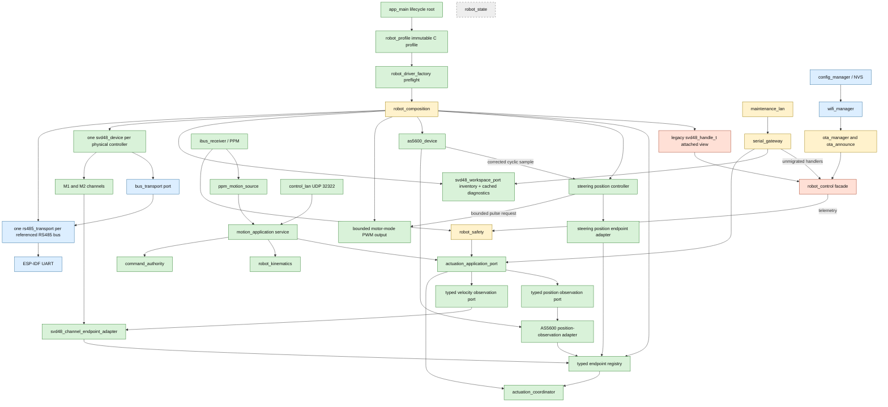
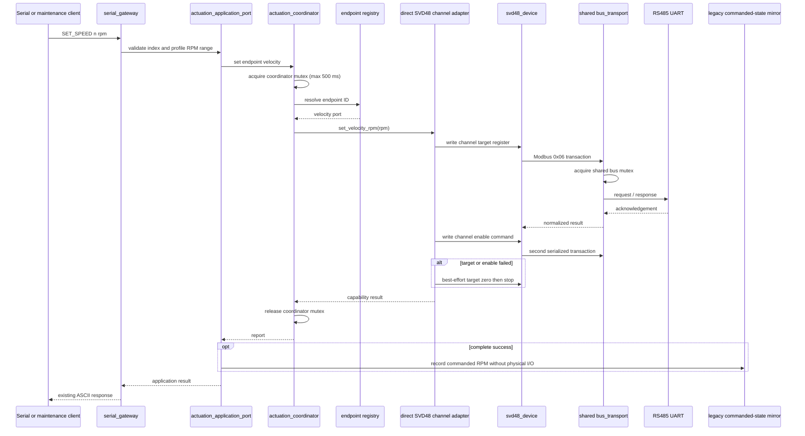
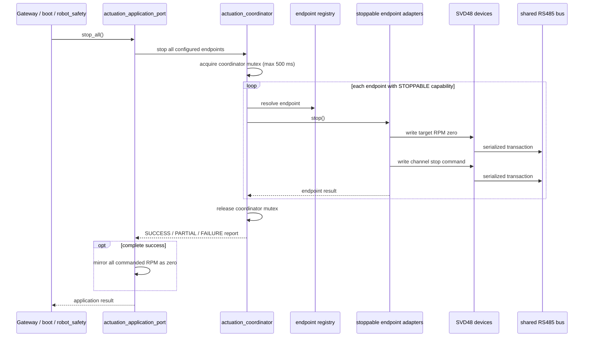
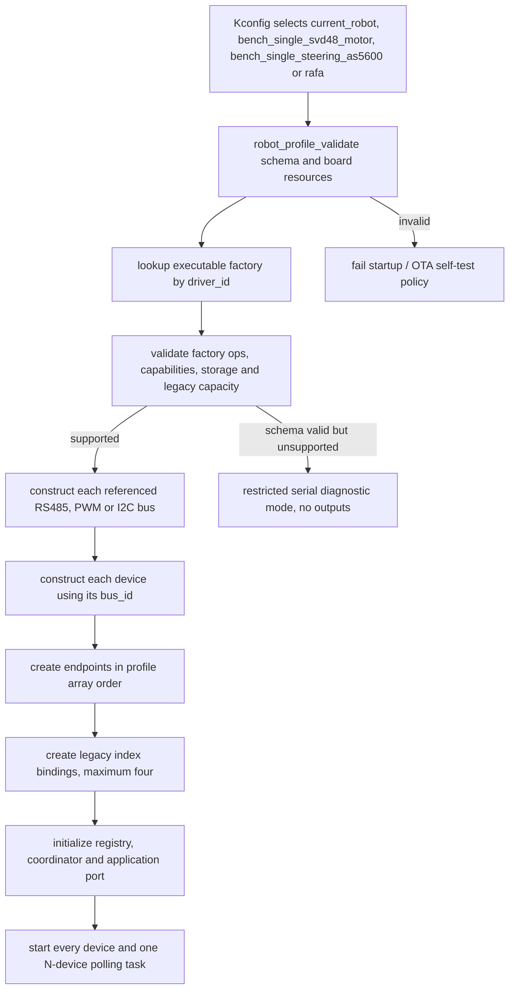
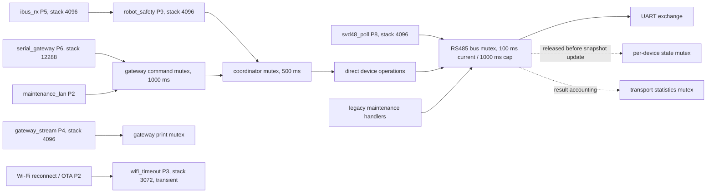

# Current architecture

## Scope and status

This document is the primary source for the architecture implemented by the
`bench-baseline-v1` Iteration 4 baseline, the current Iteration A integration and
the unqualified single-axis steering development slice. It is an as-built
description, not a target design or a physical qualification record. Superseded
target and migration rationale is retained only in the [documentation archive](archive/README.md).

The firmware is bench-only. `app_main()` is the composition root; component-owned
FreeRTOS tasks perform runtime work after startup, and the main task sleeps. The
runtime topology comes from one immutable, build-selected C profile. There is no
JSON/YAML loader. The executable factory registry supports SVD48 plus the narrow
development steering chain described below (motor-mode PWM, AS5600 and a steering
position controller); it is not a general runtime factory for arbitrary drivers.

## Components and dependencies

The active speed/stop adapter is the direct SVD48 channel adapter. In the selected
steering development profile, the steering-position endpoint adapter is instead the
only normal owner of the motor-mode PWM output after initialization; the raw PWM
device is not exposed as a position endpoint. The `robot_control_endpoint_adapter`
is retained only for host characterization and is not wired by `robot_composition`.
`serial_gateway` depends on the application port and primitive diagnostic data; it
does not depend on profile, composition or the coordinator implementation. It can
enumerate endpoints, command velocity or position, stop by logical endpoint ID, and
read typed velocity or position observations without exposing the concrete controller
or sensor to its client. The separate `svd48_workspace_port` is a concrete read-only
maintenance projection: it enumerates configured SVD48 device IDs, bus/addresses,
physical M1/M2 bindings and cached channel snapshots. It exposes no actuation method;
workspace writes re-enter the application/coordinator boundary by endpoint ID.

For a profile with validated differential geometry, `main` also creates one
`motion_application` service and starts `control_lan` on UDP `32322`. The transport
callback only copies ARM/COMMAND/DISARM/STOP events into semantic mailboxes; it never
calls a driver or constructs an SVD48 command. The service applies LAN intent to the
existing authority model, computes all wheel targets once through `robot_kinematics`,
then submits one multi-endpoint velocity request through `actuation_application`.
Profiles without qualified geometry construct neither service and report
`CONTROL_UNAVAILABLE` through the read-only status command. Rafa now has an explicit
two-wheel differential mapping and therefore constructs this path.

## `SET_SPEED` sequence

The target and enable writes execute while the coordinator mutex is held. The bus
mutex separately serializes this device with polling, maintenance and other devices
on the same RS485 bus. Channel commands use the retries configured by the bus
profile; generic maintenance writes do not retry an ambiguous lost acknowledgement.

## `STOP ALL` sequence

`STOP n`, boot stop and safety stop use the same boundary. A boot-stop failure still
logs a warning and normal startup continues. The mutex prevents migrated operations
from interleaving, but it is not a priority-aware owner task: a safety stop may wait
up to 500 ms to acquire it and then behind the current bus transaction.

## Profile-driven construction

The executable registry declares byte capacity for runtime device slots, endpoint
capacity and the transitional legacy binding capacity. Preflight sums each factory's
`storage_required()` result with overflow checks. More than four compatibility
bindings produces `LEGACY_BINDING_LIMIT`; it is not an SVD48 device/channel limit.
The active SVD48 composition also rejects an empty endpoint set, zero or unsupported
capabilities, inverted limits, unschedulable periods and any velocity endpoint that
lacks `STOPPABLE`. These checks complete before a bus or device is constructed.

The SVD48 factory requires one dual-channel physical device and resolves its
transport by `device.bus_id`, never by array position. Because the legacy maintenance
API still identifies a controller only by Modbus address, repeated SVD48 addresses
across buses are rejected until that API carries bus/device identity.

The supported profiles are:

| Profile | Bus/device topology | Endpoint topology | Geometry |
| --- | --- | --- | --- |
| `current_robot` | One referenced RS485 bus, devices at addresses 1 and 2 | Four logical endpoints, IDs 1–4, ordered drive 1 M1/M2 then drive 2 M1/M2 | Differential |
| `bench_single_svd48_motor` | One referenced RS485 bus, one device at address 1 | Endpoint ID 1, `bench_motor`, at legacy index 0 and physical channel M1 | None |
| `bench_single_steering_as5600` | One motor-mode PWM device, one AS5600 on its own I2C bus and one local steering controller | ID 1 `bench_steering_position` (`POSITION` + `POSITION_REFERENCE` + `STOPPABLE`); independent ID 2 `bench_steering_position_feedback` (`POSITION_OBSERVATION`) | None; development bench only |
| `rafa` | One RS485 bus, one SVD48 at address 2; PPM source on GPIO14 | ID 1 `rafa_traction_m1`: right/+1; ID 2 `rafa_traction_m2`: left/−1; both direct-drive and ±40 RPM | Differential: radius 0.20 m, track 1.52 m, max vx 0.8 m/s, max wz pi/6 rad/s, temporary B42 TTL 500 ms (normally 300 ms) |

The SVD48 bench profile does not invent a second controller. `SET_SPEED 0`, `STOP 0`
and `STOP ALL` are routable; index 1 is invalid and `MOVE_VEL` is unsupported because
there is no application geometry. Both SVD48 profiles also declare a GPIO RC bus,
which `main` consumes separately from SVD48 composition.

`rafa` also uses the executable SVD48 factory and preserves the physical M1/M2 names.
It contains no second controller, servo, AS5600 or steering endpoint. `main`
initializes GPIO14 through `IBUS_RECEIVER_MODE_PPM`; the profile-enabled
`ppm_motion_source` reads only fresh validated frames and publishes semantic RC events
to `motion_application`. CH5≤1500us grants PPM priority, CH2 high maps to forward,
and CH4 high maps to a right turn. Its mandatory neutral-before-arm handshake is owned
by the source; the source has no driver or transport dependency. Its
operator-qualified differential profile maps M1 to right/+1 and M2 to left/−1 with
direct drive, 0.20 m radius and 1.52 m track. Body limits are 0.8 m/s and pi/6 rad/s
with a temporary B42 500 ms TTL (normally 300 ms); endpoint limits remain ±40 RPM.
The diagnostic changes no deadman, STOP or RC-priority rule. CH2/CH4 calibration is
1000/1500/2000us inside a separate 750..2250us validity envelope, while profile-owned
CH6 linearly scales both axes from 0.50 to 1.00. Differential v1 consumes track width
and radius, not wheelbase. The geometry and mapping are the profile values in Rafa's
OTA-verified build 35; B42 changes only its temporary diagnostic TTL. None of these
are physical motion evidence.

## Communication reliability ownership

The firmware distinguishes one raw wire attempt from an operational conclusion.
`communication_quality_model` is a small pure temporal primitive used by the SVD48
primary velocity observations. It retains last-good timestamp, raw failure reason,
consecutive/total good and failure counters, source-owned age thresholds, and an
effective state. It does not parse CRCs, frames or device faults: those remain in
their protocol owners.

For each SVD48 M1/M2 channel, position, speed and current are the high-rate liveness
set. A bad CRC, timeout or incomplete primary transaction preserves their cached
values and timestamps, then updates quality as `TRANSIENT_FAILURE` (one failure),
`SUSPECT` (two), or `DEGRADED` (three). A last-good age beyond the configured stale or
offline threshold wins regardless of count; recovery from degraded/stale/offline
requires two complete primary observations. Slow status, temperature and bus fields
retain independent timestamps and may be stale without making the velocity endpoint
stale. A fresh, valid nonzero SVD48 controller error remains an immediate `FAULT` and
does not pass through this debounce.

PPM has no checksum, so its integrity boundary is `ppm_decoder`: Rafa's profile
requires exactly eight pulses. Frames with fewer or extra pulses are counted and
discarded atomically; they never replace channels, advance the valid-frame sequence,
affect CH5, or reach `ppm_motion_source`. `robot_safety_rc_lan_interlock_model` owns
the separate three-fresh-frame CH5 authority confirmation. Lack of accepted frames
still follows the unchanged receiver/safety age deadline; confirmation never extends
it. `ppm_motion_source` receives the committed-authority gate: it cannot turn a
PPM-priority candidate into RC motion, while a transient failsafe candidate retains
an already committed PPM source until the three-frame transition completes.

`control_lan` keeps its existing command-authority/TTL path. Its status now reports
accepted/rejected packets, sequence gaps, duplicate/out-of-order packets, schema and
authentication rejects, and last-valid-command age. These are link-quality evidence;
they do not create a second deadline or relax the existing TTL/deadman STOP behavior.

The read-only maintenance projection exposes resulting SVD48 quality, LKG age,
streaks and raw last failure alongside existing field masks. It is a cached diagnostic
view; it does not start an RS485 transaction or become an actuation owner. See
[Communication reliability audit](COMMUNICATION_RELIABILITY_AUDIT.md) and
[communication safety matrix](COMMUNICATION_SAFETY_MATRIX.md) for the full
cross-vertical contract.

The transitional legacy `MOVE_VEL` facade remains a distinct four-wheel implementation
and is enabled only when four legacy SVD48 bindings and a positive wheelbase exist.
Rafa's two-endpoint geometry activates only the dedicated `motion_application` path;
it does not make legacy `MOVE_VEL` available.

`bench_single_steering_as5600` is deliberately isolated from the traction profiles:
its PWM GPIO is a motor-mode output rather than an RC input, and it has no geometry
or traction endpoints. Its actuator, sensor and controller are three distinct
profile devices. The controller owns the actuator's bounded PWM callback; the AS5600
adapter exposes a separate read-only observation endpoint. This is a development
composition, not evidence that the connected mechanism, wiring, PWM polarity or
reported angle has been physically qualified.

## Motor-mode steering, AS5600 and calibration boundary

The steering development chain has three intentionally independent responsibilities:

- `motor_mode_pwm` bounds and writes a PWM pulse. In this mode a pulse requests a
  direction and speed; it never means that a requested steering angle was reached.
- `as5600_device` owns I2C/register decoding, magnetic-status diagnostics, raw phase
  and the profile-supplied cyclic correction. Its endpoint adapter converts only an
  approved, fresh and magnet-detected sample that has also been explicitly referenced
  into a generic `PositionObservation`. It reports the source as an independent
  sensor and makes `valid` false when calibration or reference is absent, or when the
  sample is stale, offline or not magnet-backed.
- `steering_position_controller` receives corrected cyclic samples and owns the local
  target/neutral/reversal policy. It owns neither I2C nor GPIO; the endpoint adapter
  supplies the sensor sample and bounded PWM callback.

The public position actuator and position-observation endpoints remain separate even
though this bench controller uses the AS5600 as its local feedback input. That
separation prevents a generic test from reaching into PWM, I2C or AS5600 registers;
it does not by itself establish independent physical evidence or a passed L5 gate.

The controller begins **UNHOMED** and commands neutral until a maintenance operation
explicitly maps a fresh, physically verified pose to the logical coordinate system.
Neither initialization nor a normal position request infers mechanical zero from the
cyclic AS5600 phase. The normal serial position API does not auto-home; the explicit
reference operation is maintenance-only, requires an already stopped and safe setup,
is not evidence that the physical reference is correct, and cannot clear or re-arm a
latched steering-controller fault.

The empirical material on `origin/ensayo-nueva-pata` is design input, not a physical
pass for this integration. The offline
[`analyze_as5600_linearity.py`](../tools/analyze_as5600_linearity.py) tool accepts a
positive and a negative capture with at least seven complete turns each, rejects
incomplete, non-monotonic or mutually incoherent passes, and emits a candidate
128-node cyclic centidegree LUT. Candidate and fixture identity are required; a
separate cross-validation mode applies a fixed candidate to a distinct capture and
reports residuals without refitting it. Its JSON contains input/LUT hashes, pass
counts and quality metadata but never preserves raw samples. A strictly monotonic LUT
prevents an invalid phase mapping; it does not prove mechanical zero, absolute physical
angle, current magnet alignment or closed-loop performance. Per-turn checks also
cannot prove that intra-turn speed ripple was not mistaken for phase nonlinearity. A
reviewed candidate must remain scoped to its named fixture, sensor, magnet, shaft and
geometry before it becomes a static profile calibration. Raw captures and durable
evidence remain external.

The scoped historical candidate reduced an inferred historical validation from 8.171°
to 3.597° combined RMSE, but still had 7.925° P95 and 15.924° maximum absolute
post-correction residual. It was based on a constant-speed inference and is not a
physical accuracy claim for this profile. The controller's `[0°, +3°]` arrival band
therefore controls its local neutral/drive decision only; it cannot be reused as an
L4/L5 measurement tolerance without new independent L3 evidence.

## Polling, observations and health

One `svd48_poll_service` schedules every configured physical device. Position,
speed and current are read on every poll; status, motor temperature, bus voltage,
MOS temperature and error code are added every twentieth poll. A poll is:

- `OK` only when every observation scheduled for that poll succeeds;
- `PARTIAL` when at least one scheduled read succeeds and at least one fails;
- a concrete transport/protocol error when no scheduled read succeeds.

Each channel snapshot carries valid, failed and stale observation masks plus a
timestamp per observation. A success for current cannot update or clear speed. A
channel is `OFFLINE` when recent valid communication is absent, `FAULT` when a fresh
error-code observation is nonzero, `STALE` when an observation has expired or was
never valid, `DEGRADED` after an incomplete result with still-fresh prior data, and
`HEALTHY` only after a complete poll with all observations valid and fresh.

`PARTIAL` is a polling-service failure for backoff. Backoff never shortens the
device's nominal period and is scheduled from the instant that device's poll
finishes. Deadlines use explicit scheduled state and signed modular comparison, so a
wrapped deadline of zero is not confused with an uninitialized entry. A per-device
poll guard prevents the shared task and legacy `POLL_ONCE` from interleaving cycles;
the concurrent request receives `BUS_BUSY` without advancing the poll cycle.

The manufacturer contract names given speed (`0x5304/0x5305`) and observed motor
speed (`0x5410/0x5411`) as RPM. The driver preserves the signed raw register value
without a factor-of-ten conversion. That raw observation already feeds the legacy
5-RPM readiness gate for OTA/maintenance and the motion state reported by
`PLATFORM_STATUS` when it is online and fresh. It is not independent evidence that
the physical axis moved; controlled physical qualification and a reviewed fail-safe
policy remain required.

Iteration A exposes the same controller-derived speed through the typed
`robot_velocity_observation_t` application boundary. The value includes validity,
RPM, sample timestamp, source, online, speed-specific stale and channel-health
semantics. `GET_ENDPOINT_OBSERVATION` uses that boundary and identifies its type as
`VELOCITY_RPM`; it is E2 controller feedback, not an independent E3 sensor.

The steering slice adds a typed `robot_position_observation_t` boundary without
making position actuation imply position observation. It preserves degrees, timestamp,
source endpoint/source class, online, stale, health, acquisition status and explicit
`calibrated`/`referenced` provenance. The AS5600 adapter sets `calibrated` only for
the profile-approved LUT and refuses to expose the value as valid logical feedback
without both that approval and an explicit controller reference. This source-level
contract makes a future generic position test possible; it is not a physical sensor
qualification, E3 result or L5 pass.
Current and temperature observations remain future work.

The current one-axis profile clocks the bit-banged AS5600 bus at 5 kHz and schedules
each control-rate poll every 40 ms. Each poll makes one contiguous three-byte
`STATUS+RAW_ANGLE` transaction; a separate
three-byte AGC/magnitude diagnostic is attempted only once after the first successful
primary sample. The profile's 25 ms response deadline includes a conservative
bit-bang recovery-path and CPU/GPIO allowance. Profile validation then budgets the
initial two-transaction slot, the 40 ms polling cadence and the 10 ms service cadence
against the controller's 120 ms stale-to-neutral window. Deadlines schedule from their
prior slot rather than from completion, skipping an overdue slot instead of accumulating
drift. This prevents a profile from making that local software policy internally
impossible, but it is not a scheduler-jitter, physical neutral or stop-latency
measurement.

The steering adapter treats a known `STATUS.ML` field warning as a narrowly named
development exception only when `STATUS.MD` remains set and the primary read succeeded.
It does not generalize `DEGRADED` health into permission to drive: `MH`, missing `MD`,
partial diagnostics and failed primary reads are rejected. A first-poll diagnostic
failure consequently becomes a local latched sensor fault rather than an automatic
retry/re-arm route. PWM construction attaches neutral duty before routing the pin;
deinit requests neutral, stops LEDC and releases the GPIO. Its electrical transition
remains an L3 hardware observation, not an asserted physical safety guarantee.

## Tasks and locks

The coordinator mutex is acquired before a migrated device call; the device then
acquires the bus mutex. It prevents two coordinated commands from interleaving.
Polling and legacy maintenance do not acquire the coordinator, so they can run
between the individual bus transactions of a coordinated target/enable or
target-zero/stop sequence even while the coordinator is held. Every individual
RS485 transaction remains serialized. Snapshot state and 64-bit transport
statistics use separate locks, and the bus lock is released before either is
updated. This avoids a bus/state lock cycle, but it does not create stop precedence
or global single-writer authority.

Composition configures a 1000 ms RS485 lock cap. `bus_transport` clips lock
acquisition to the transaction timeout, however, and both SVD48 profiles configure
100 ms, so 100 ms is the effective bus-lock acquisition bound for their SVD48 calls.

| Task | Priority | Stack | Active mode |
| --- | ---: | ---: | --- |
| `robot_safety` | 9 | 4096 | Supported normal runtime |
| `motion_app` | 9 | 6144 | Only for a profile with validated differential geometry; 20 ms service period |
| `svd48_poll` | 8 | 4096 | Supported normal runtime |
| `steering_ctl` | 8 | 4096 | Only when a selected profile contains AS5600 steering; 10 ms controller tick, profile-scheduled sensor polling |
| `serial_gateway` | 6 | 12288 | Normal and restricted diagnostic runtime |
| `ibus_rx` | 5 | 4096 | Normal runtime when the RC bus is present |
| `control_lan` | 5 | 6144 | Only with `motion_app`; authenticated UDP intent ingress on port 32322 |
| `ppm_motion` | 8 | 4096 | Rafa only; converts fresh validated PPM frames into semantic RC intent |
| `gateway_stream` | 4 | 4096 | Normal runtime only |
| `wifi_timeout` | 3 | 3072 | Transient normal-runtime connection attempts |
| Wi-Fi reconnect | 2 | 4096 | Normal runtime only |
| OTA automatic check | 2 | 8192 | Normal runtime when available |
| OTA announce | 2 | 8192 | Normal runtime when available |
| Maintenance LAN | 2 | 12288 | Normal runtime when available |

## Startup and lifecycle

Normal startup initializes NVS/configuration, initializes Wi-Fi/OTA handles, selects
and composes the profile, creates the legacy facade, attempts boot stop, starts the
profile's polling/control services, RC and safety where present, then starts the
serial gateway and optional network tasks.
Shutdown and construction failure unwind tasks, adapters, devices and buses in
reverse order. A poll-task stop timeout preserves every device, lock and transport
dependency; restart is rejected until a later stop call collects the task's completion
signal. This late-completion path is source-contract and firmware-build verified, not
runtime fault-injected under FreeRTOS.

If schema validation succeeds but executable preflight cannot support the profile
(including a missing factory or static-capacity failure), no bus or device output is
constructed. For a non-pending OTA image, `main` starts only the serial RX gateway in
`diagnostic_only` mode. It permits `PING`, `VERSION`, `HELP`, read-only platform,
configuration, Wi-Fi, profile and composition status, plus `STOP ALL`. With no
endpoints, stop returns `ERR STOP_UNAVAILABLE OUTPUTS_NOT_INITIALIZED`; all other
commands return `ERR DIAGNOSTIC_MODE_COMMAND_BLOCKED`. It does not start the stream,
RC, safety, Wi-Fi reconnect, OTA, announce or LAN tasks. A pending OTA image retains
the existing rollback-on-self-test-failure policy instead of accepting diagnostic
mode as a successful self-test.

In normal serial mode, `VERSION` reports the full build Git SHA and dirty flag,
`PROFILE_STATUS` reports the selected board, and `ENDPOINTS` reports logical IDs,
names, criticality, capability discovery, availability and velocity/position bounds.
`SVD48_INVENTORY` and `GET_SVD48_CHANNEL_TELEMETRY` provide the concrete device/channel
projection needed by the Engineering Console without using the four-binding legacy
motor view. The bounded `SVD48_BENCH_*` commands resolve device plus M1/M2 through that
inventory, then use the same application/coordinator speed or stop path as migrated
endpoints. The direct channel adapter—not the gateway or UI—owns target-plus-START and
target-zero-plus-STOP sequencing.
Before an allowed Maintenance-LAN operation executes, the gateway consults the
optional motion-status port. `ARMED`/`ACTIVE` blocks bench set-speed/hold and SVD48
configuration write/save operations, while unavailable/disarmed control permits the
existing maintenance gates and stop/disable remain callable.
The endpoint-scoped speed, position, stop and typed-observation commands use the
application boundary; they are deliberately unavailable through the LAN-safe policy
and in restricted diagnostic mode. An explicit position-reference operation is a
maintenance path: it first stops the endpoint, requires an affirmative confirmation
token and must not be confused with a normal position command or automatic homing.
Availability inhibits ordinary actuation and observation, but does not suppress a
stop attempt for an existing stoppable endpoint. Legacy numeric-index commands remain
compatible.

The host-only runner in `tools/hil_runner.py` consumes this normal application API
from a versioned manifest. It adds orchestration, identity gates, bounded commands,
assertions, evidence and best-effort cleanup outside the firmware; there is no
firmware test mode or hardware-specific bypass. The runner is not an actuation
authority, TTL/deadman implementation or emergency stop, so it does not close the
minimum-safe-motion gate. Its current executable manifests cover only generic
velocity; the steering preparation does not claim a runnable steering HIL pass.

## Transitional and dormant boundaries

The legacy wrapper and `robot_control` still own `ENABLE`, `MOVE_VEL`, fault clear,
telemetry, trace, OTA preparation and register/configuration maintenance. They also
own `SVD48_IDENTIFY START|STOP`, which writes the physical identification register
and can move a motor. These paths do not all pass through the coordinator.
`robot_safety` emits migrated stops but still consumes legacy telemetry, so the new
health model is not yet the active safety policy.

`command_authority`, `robot_kinematics` and `control_lan` are now active only behind
`motion_application` for differential profiles. `robot_state` remains dormant. The
semantic service gives STOP/DISARM mailbox precedence, drops an older pending APPLY,
and turns source expiry into a global stop request. It cannot preempt a coordinator
transaction already executing; the residual stop bound still includes that bounded
transaction plus the service period. Other legacy hardware-changing paths continue to
bypass this authority, so this is not yet a system-wide single-owner or production
control protocol. See the [firmware handoff state](NEXT_STEPS.md).
