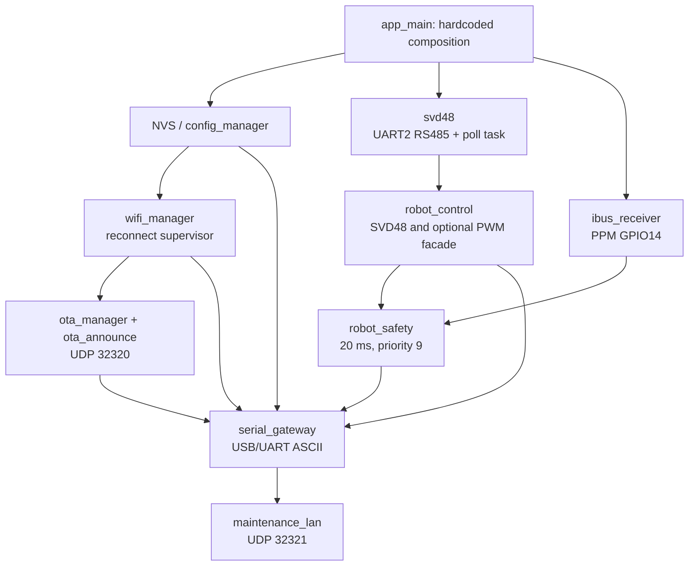
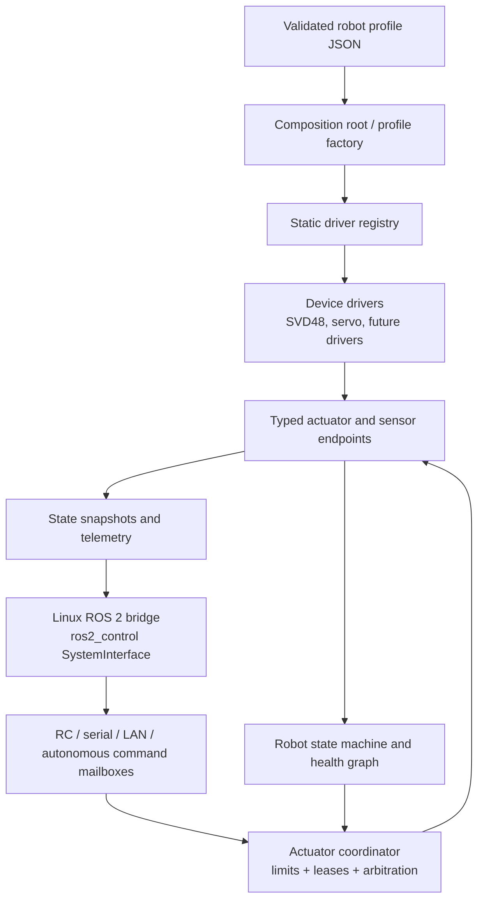

# Architecture

## Scope

This document describes build 19 as it exists and the target structure for a
profile-driven, ROS-ready controller. It does not claim that the target design is
already implemented.

## Active runtime

`main/app_main()` is the composition root. It creates components in dependency
order and then sleeps; behavior runs in component-owned FreeRTOS tasks.

The intended task hierarchy is safety first and network last:

| Work | Priority | Notes |
| --- | ---: | --- |
| Robot safety | 9 | RC-loss and reported motor-fault stop requests |
| SVD48 poll | 8 | Serialized RS485 telemetry |
| Serial gateway | 6 | Command input |
| RC receiver | 5 | PPM/iBUS decoding task |
| Gateway telemetry | 4 | Optional serial stream |
| Wi-Fi support | 2-3 | Reconnect and timeout work |
| OTA/LAN maintenance | 1-2 | JSON, sockets, HTTP and hashing |

Network failure is non-fatal to robot startup. Wi-Fi and OTA do not belong in
the control loop and must not acquire the RS485 lock except through an explicit
command routed to the existing robot/driver API.

## Component status

| Component | Runtime status | Responsibility |
| --- | --- | --- |
| `svd48` | Active | Driver, protocol framing, bus lock and telemetry cache |
| `robot_control` | Active | Current monolithic motion/actuator facade |
| `robot_safety` | Active | Reactive RC-loss and motor-error stop task |
| `ibus_receiver`, `ppm_decoder` | Active | RC acquisition and pure PPM decoder |
| `serial_gateway` | Active | ASCII parser, responses and LAN command policy |
| `config_manager`, `wifi_manager` | Active | NVS settings and station reconnect |
| `ota_manager`, `ota_announce` | Active | Manifest OTA and LAN offers |
| `maintenance_lan` | Active | Authenticated UDP wrapper for selected ASCII commands |
| `robot_state` | Compiled, dormant | Host-tested state model/service foundation |
| `command_authority` | Compiled, dormant | Host-tested authority model foundation |
| `robot_kinematics` | Compiled, dormant | Host-tested differential kinematics |
| `control_lan` | Compiled, dormant | Sequenced control protocol; not initialized in `main` |

Compiled does not mean integrated. Do not document or expose a dormant component
as a firmware capability until `main` wires it and an end-to-end test covers it.

## Current coupling

The current `robot_control` knows both the SVD48 topology and optional steering
PWM. Serial and maintenance handlers can invoke this facade directly. This made
bench work fast, but it does not scale to robots with different drivers,
actuator counts or steering arrangements. Hardware constants are also compiled
into `main/main.c`.

## Target architecture

The ESP32 remains a deterministic, ROS-agnostic safety controller. A Linux
computer can later expose it to ROS 2 through a `ros2_control::SystemInterface`.
ROS must not bypass firmware limits, authority arbitration or the stop path.

Use these boundaries:

- **Device**: a physical controller or peripheral with lifecycle and bus details.
- **Endpoint**: one typed capability, such as velocity actuator, position actuator,
  encoder, voltage sensor or fault source.
- **Coordinator**: the only writer of actuator setpoints after startup.
- **Authority mailbox**: latest immutable command per source, with sequence and TTL.
- **Health graph**: required/optional capabilities and their effect on operating
  modes; absence is not automatically a global fault.
- **State machine**: explicit boot, safe idle, armed, active, fault and maintenance
  transitions with guards and entry actions.

## Configuration boundary

There is no supported robot-profile schema or runtime parser yet. A previous draft
was removed because it incorrectly claimed runtime adoption and required a fixed
RS485/traction topology, which contradicted servo-only and other development
profiles.

The mature split should be:

- Robot profile JSON: embedded hardware, buses, devices, endpoint mapping, limits,
  required/optional policy and enabled capabilities.
- URDF/xacro: ROS geometry, links, joints and transforms.
- `ros2_control` configuration: generated from or cross-validated against both,
  never maintained as an unrelated third topology.

Profiles are validated before tasks start. Firmware uses a static registry of
compiled drivers; configuration selects known implementations but never loads
arbitrary code.

## Design patterns

- Composition root for all object creation and startup ordering.
- Ports and adapters between domain logic and ESP-IDF/UART/PWM/network code.
- Strategy plus static factory/registry for motor and servo drivers.
- Explicit state machine for lifecycle and safety modes.
- Command pattern using bounded immutable messages, sequence numbers and deadlines.
- Single-writer coordinator for actuator output.
- Snapshot/observer model for telemetry so readers never drive hardware.
- Capability-based health policy instead of assumptions about a fixed robot.

Do not create a universal driver interface so weak that type safety disappears.
Use small capability interfaces, for example velocity, position and feedback,
because not every actuator supports the same operations.
