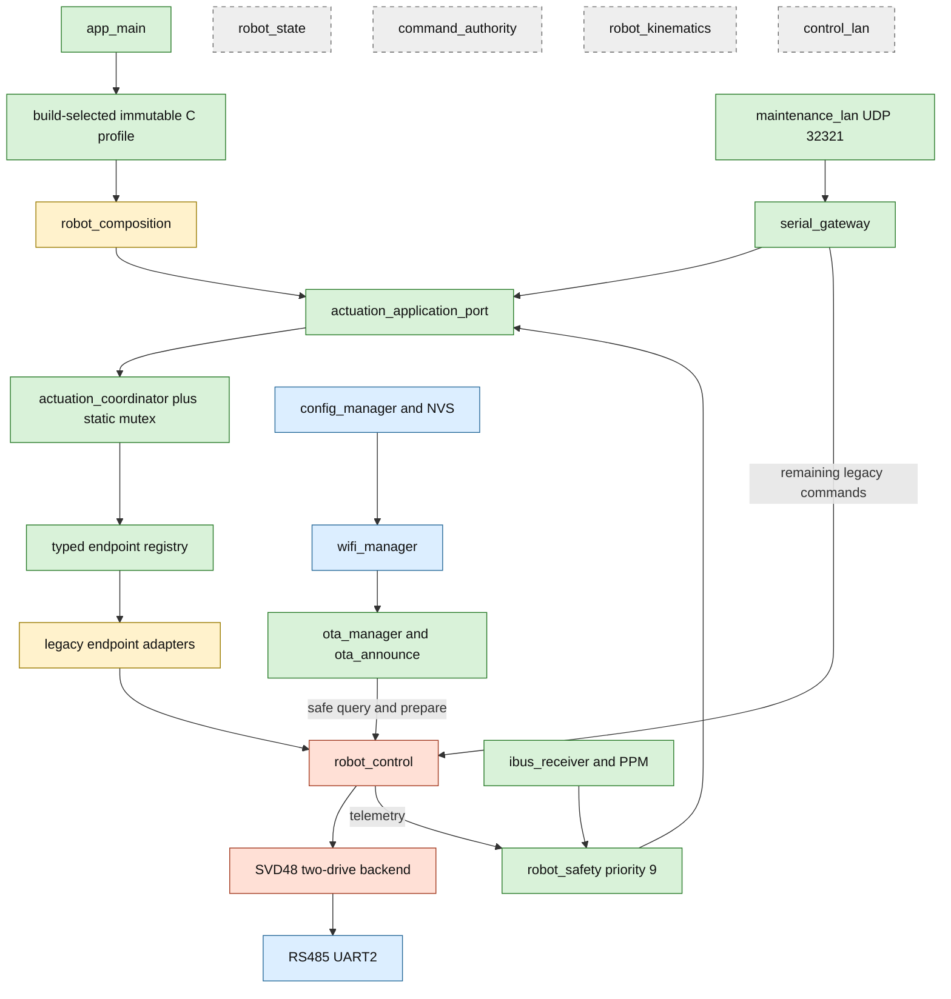
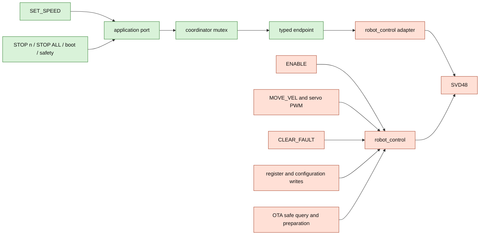
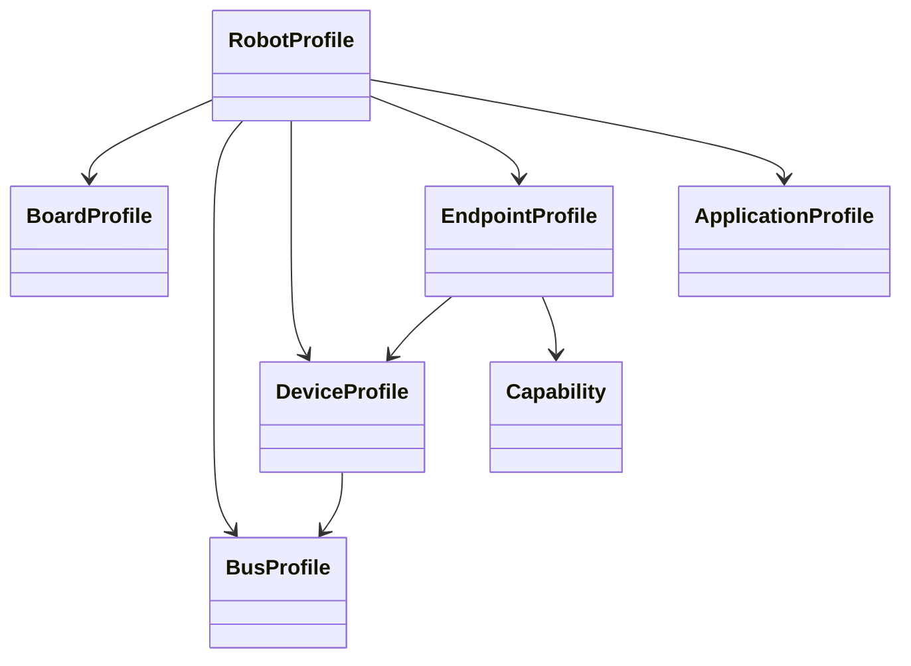
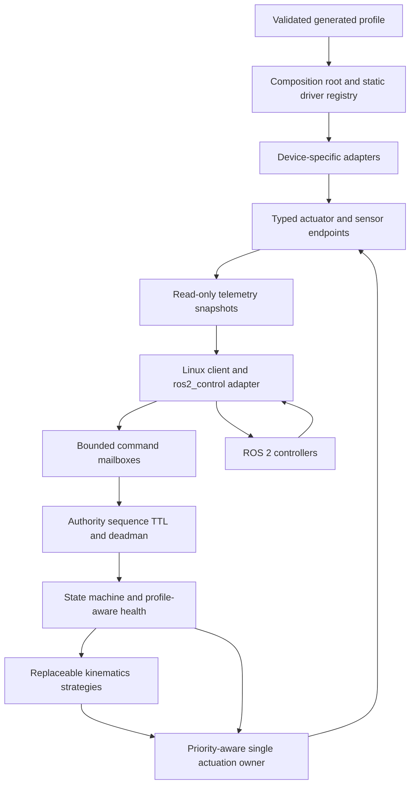

# Architecture

## Scope and status

This document describes build 19 after the layered-foundation hardening merge.
The firmware has an active profile and typed actuation path, but remains bench-only.
It is not yet a general robot runtime or a production safety controller.

`app_main()` is the composition root. Component-owned FreeRTOS tasks perform the
runtime work after startup; the main task sleeps.

## Active runtime

The application port keeps transports and safety independent from profile,
composition and coordinator implementation details. The transitional adapters still
delegate physical writes to `robot_control`; direct SVD48/PWM adapters do not exist.

## Actuation paths

The mutex serializes complete migrated operations, including target write, enable,
multi-endpoint stop and rollback. Its acquire timeout is 500 ms. Driver calls execute
while the mutex is held, so a safety stop can wait behind an in-progress operation.
This prevents interleaving but does not provide stop precedence, authority, TTL,
deadman or an operating-state guard.

## Profile and composition

The schema-versioned C model represents board resources, buses, devices, channels,
typed endpoints, criticality and optional application geometry. Validation rejects
unsupported board resources, duplicate identities/names/channels/addresses, pin
conflicts, incompatible driver/bus/capability combinations and invalid limits.

Kconfig can select `current_robot` or `bench_single_svd48_motor`. Only
`current_robot` is executable: `main` and `svd48` still require two dual-channel
SVD48 devices. Selecting the single-motor profile causes a deliberate startup halt
before serial or LAN diagnostics. PWM and fake-CAN fixtures prove schema validation,
not runtime driver support. There is no JSON/YAML loader or profile generator.

## Tasks and priorities

| Work | Priority | Runtime status |
| --- | ---: | --- |
| Robot safety | 9 | RC-loss and reported motor-fault stop requests |
| SVD48 polling | 8 | Serialized RS485 telemetry |
| Serial gateway | 6 | ASCII command input |
| RC receiver | 5 | PPM/iBUS acquisition |
| Gateway telemetry | 4 | Optional serial stream |
| Wi-Fi reconnect | 2-3 | Low-priority infrastructure |
| OTA and maintenance LAN | 1-2 | Sockets, JSON, HTTP and hashing |

Network failure is non-fatal to local startup. Network, storage and JSON work stay
outside the safety task. An explicit maintenance command may reach the actuation
port, so LAN is still a trusted bench interface rather than a production control
transport.

## Component status

| Component | Status | Current responsibility |
| --- | --- | --- |
| `robot_profile` | Active | Build selection and bounded profile validation |
| `robot_composition` | Active, transitional | Fixed SVD48 adapters, application port and static mutex |
| `robot_capabilities` | Active | Portable velocity, position and stop contracts |
| `actuation_coordinator` | Active, partial | Serialized migrated speed/stop execution and reports |
| `robot_control_endpoint_adapter` | Active, transitional | Typed endpoint to legacy motor mapping |
| `robot_control` | Active, legacy | Kinematics, PWM, telemetry, OTA helpers and remaining writers |
| `svd48` | Active, fixed backend | UART transactions, polling and two-drive mapping |
| `robot_safety` | Active, mixed | Legacy observations and application-port stop requests |
| `serial_gateway` | Active, mixed | Parser with migrated and legacy handlers |
| `maintenance_lan` | Active | Authenticated UDP delegation to gateway policy |
| `robot_state` | Dormant | Host-tested state model and service |
| `command_authority` | Dormant | Host-tested sequence, lease and deadman model |
| `robot_kinematics` | Dormant | Host-tested differential kinematics strategy |
| `control_lan` | Dormant | Sequenced protocol not initialized by `main` |

Compiled and host-tested does not mean integrated into firmware behavior.

## Target ROS-ready architecture

The ESP32 remains ROS-agnostic and owns local expiry, safety and physical outputs.
A Linux process can later expose the versioned embedded contract through
`ros2_control`; ROS must not bypass firmware authority or stop policy.

The next critical boundary is the single-owner command mailbox with explicit stop
precedence. It should integrate the existing authority and state models before more
motion transports or ROS bindings are added.
