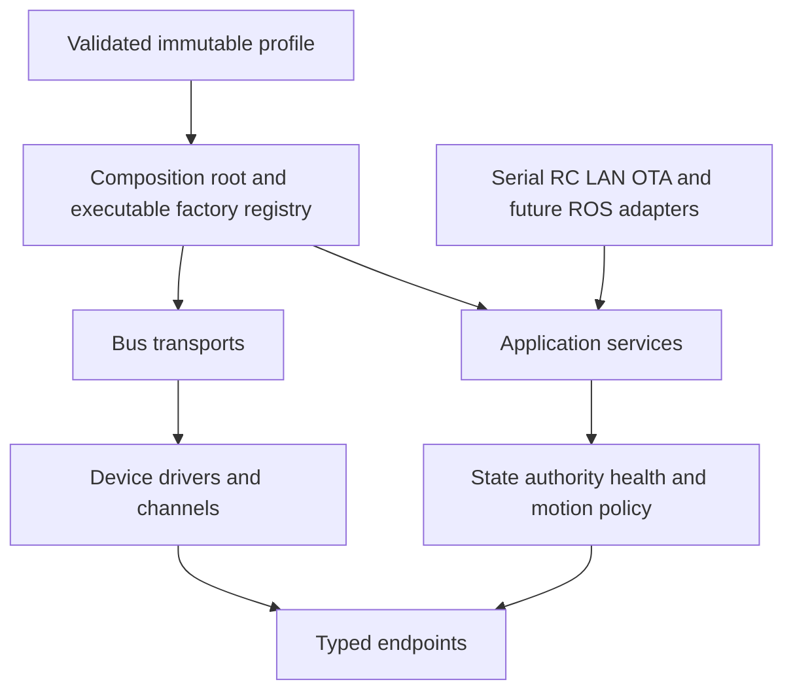
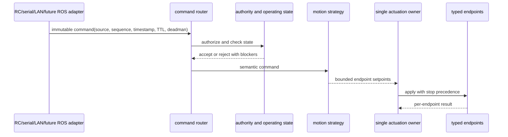
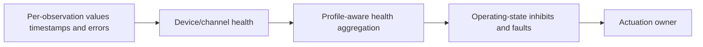
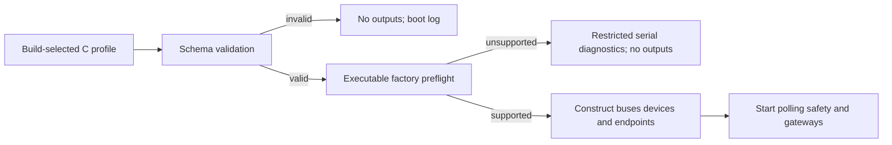

# Target architecture and migration rationale

## Status and source of truth

This document explains the remaining target and why the migration is incremental.
It is not the as-built description. See [Architecture](ARCHITECTURE.md) for the
executable runtime and [Migration map](MIGRATION_MAP.md) for component-level status.

Iteration 4 already implements these foundations:

- immutable build-selected board, bus, device and endpoint profiles;
- a portable `bus_transport` and ESP-IDF `rs485_transport` with serialized bus use;
- one `svd48_device` per physical dual-channel controller and explicit M1/M2 channels;
- shared polling of a bounded set of configured devices;
- direct SVD48 channel endpoint adapters for velocity and stop;
- a synchronous mutex-serialized coordinator and gateway-facing application port;
- an executable factory registry specialized to SVD48;
- a one-device/one-endpoint bench profile without motion geometry; and
- restricted serial diagnosis, with no constructed outputs, when a schema-valid
  profile cannot be composed.

The legacy `svd48_handle_t` view and `robot_control` facade remain for compatibility.
Enable, fault clear, `MOVE_VEL`, OTA preparation, motor identification and
maintenance register/configuration writes are not yet behind the coordinator. The
wrapper accepts at most four channel bindings; that compatibility bound is not a
device or polling architecture limit.

## Why migration remains incremental

The firmware combines motion, maintenance, OTA and bench diagnostics around proven
external behavior. A flag-day rewrite would make protocol and safety regressions hard
to attribute. Each slice therefore adds a tested seam, migrates an observable path,
and retains the old facade only for callers that have not yet moved.

The principles are:

1. Configuration is validated before outputs are constructed.
2. Dependencies point from policy toward portable ports, never from domain models to
   ESP-IDF or vendor drivers.
3. A physical controller is a device; its independently addressable functions are
   explicit channels and endpoints.
4. Transport serialization, device state synchronization and actuation ownership are
   separate concerns.
5. Commanded, observed and inferred values remain distinct.
6. No servo position is inferred from PWM without independent feedback.
7. A replacement is tested before its legacy path is removed.

## Layer boundaries

- **Platform/BSP:** board resources, pins, peripherals, timers and watchdog support.
- **Transport:** bounded serialized frame exchange, cancellation, timeouts and link
  statistics; no SVD48 register or robot semantics.
- **Device:** vendor protocol, addresses, registers, channels, retries and observations;
  no robot role, command authority or global safety policy.
- **Endpoint:** stable functional identity and small typed capabilities with explicit
  limits and units.
- **Domain:** pure state, authority, health facts, commands, limits and kinematics.
- **Application:** routing, lifecycle, coordination, safety and maintenance policy.
- **External adapters:** translate protocols into semantic requests and format
  read-only results; they do not own physical outputs.
- **Composition:** validates a selected profile, finds executable factories, constructs
  dependencies and starts services in order.

## Target command and stop ownership

Iteration 4 serializes migrated speed and stop calls with a mutex. The target replaces
that synchronous shared-writer boundary with a priority-aware owner task or equivalent
bounded mailbox. Stop must have explicit precedence over motion.

The final writer boundary must include enable, fault clear, direct motion, OTA
preparation, identification and maintenance actuation/configuration registers.
Read-only telemetry may be consumed concurrently from snapshots; it must never become
another write path.

## Observation and health target

Polling success is not a single timestamp for every field. Each required observation
retains its own validity/failure bit and update timestamp; `last_poll_result` describes
the aggregate cycle. A poll has three transport/device outcomes:

- complete: every observation scheduled for that cycle succeeded (position, speed and
  current on a fast cycle, plus the slow observations when due);
- partial: the controller responded but at least one required observation failed; and
- failed: every observation attempted in that cycle failed, returning the first
  concrete transport/protocol error.

The device can consequently report healthy, degraded, stale, offline or fault without
a later current/temperature read making an old speed sample fresh. Polling applies
failure backoff to partial and failed cycles. The target health aggregator maps those
facts through profile criticality into mode inhibits and state transitions. Iteration 4
does not yet make the active safety task consume that complete profile-aware policy.

## Profile and safe startup target

The bounded C representation remains the only supported profile source. A future
host-side authoring/compiler tool may emit the same representation, but runtime
JSON/YAML parsing and unvalidated NVS topology overrides are out of scope.

Preflight distinguishes schema validity from executable composition support. A
missing factory, incompatible bus or unsupported composition does not initialize
actuator transports or endpoints. The minimal diagnostic state exposes identity,
profile and composition failure information through a restricted serial gateway. It
permits the documented identity/status allowlist plus exactly `STOP ALL`; motion,
enable, fault clear, OTA actions and device-register access are rejected.

If the booted OTA image is still pending verification, composition failure uses the
rollback path instead of this fallback; starting diagnostics must not mark an
unsupported image valid.

The diagnostic state is a recovery aid, not an armed or production-safe operating
state. A later explicit state machine must own `BOOT`, `SAFE_IDLE`, `ARMED`, `ACTIVE`,
`FAULT` and `MAINTENANCE` transitions.

## ROS boundary

ROS 2 remains outside the firmware domain. A future Linux client and
`ros2_control::SystemInterface` translate a versioned embedded contract into ROS
interfaces. ROS never bypasses firmware authority, command expiry, state, stop policy
or physical endpoint limits.

## Remaining migration order

1. Preserve the completed Iteration 4 contract/build matrix and its reviewed
   linker-map-derived shared D/IRAM floor before accepting additional runtime
   growth.
2. Integrate per-observation health and required/optional policy with the safety and
   operating-state services.
3. Replace the mutex-backed multi-writer boundary with the priority-aware single
   actuation owner and migrate every legacy writer.
4. Integrate authority sequence, TTL, deadman and source handover policy.
5. Define a versioned embedded transport and Linux client before adding ROS bindings.
6. Close every production release gate in [Safety](SAFETY.md).

No active compatibility path is removed merely because its target exists on this
diagram. Removal conditions and remaining callers belong in the migration map.
