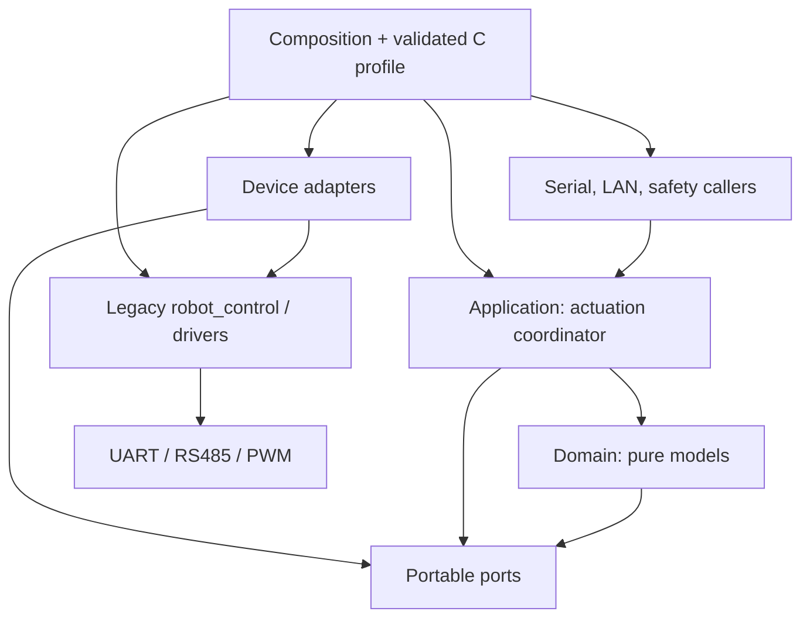
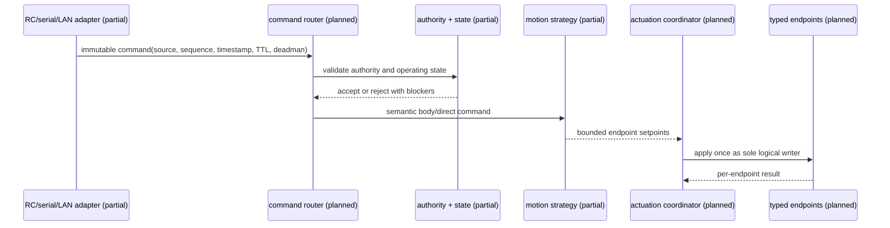
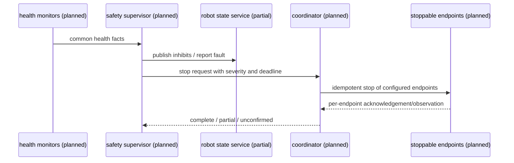
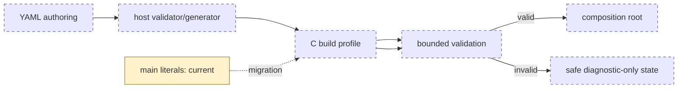
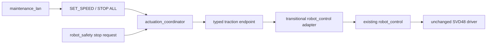

# Layered architecture refactor

## Status and baseline

This document is an implementation guide, not a claim that the target already
exists. The current runtime remains the one described by `ARCHITECTURE.md` at base
commit `ce5f1e2e5b4e784b0b877366be6f68b6778f14d1`. Phase 0 and the initial
documentary portion of Phase 1 are complete; architectural code migration is planned.

Baseline verification on 2026-08-02 found all seven CTest cases and all three
Python SVD48 protocol tests passing. The documented `tools/run_host_tests.sh`
invocation initially failed because the checked-in script lacks its executable bit;
invoking it explicitly with `bash` passed both normal and sanitizer configurations.
ESP-IDF and hardware builds were not part of this documentation-only baseline.

## Problem and objectives

The active build hardcodes board pins and two SVD48 devices in `main`, while
`robot_control` combines topology, kinematics, SVD48 operations and optional PWM.
Safety and external transports can call that facade directly. This supports the
current bench but prevents profile variation, typed capabilities and one auditable
writer.

The migration will preserve validated protocol/API behavior while introducing:

- board and robot profiles selected at build time and validated before outputs;
- explicit board, bus, device, endpoint and capability identities;
- pure, host-tested domain policy without ESP-IDF dependencies;
- one logical `actuation_coordinator` for normal output and stop execution;
- transport-neutral immutable commands with authority, sequence, TTL and deadman;
- adapters for RC, serial, LAN and future ROS/micro-ROS.

## Principles and dependency direction

Dependencies point toward stable ports and lower-level mechanisms, never from the
domain to ESP-IDF or a vendor driver. C opaque handles and small operation tables
are preferred over a universal Motor type or repository-wide C++ conversion.

The diagram is status-coded: green is active, amber is partial/dormant foundation,
and dashed blue is planned.

## Core vocabulary

| Concept | Contract |
| --- | --- |
| Board | Physical revision and available/reserved pins/peripherals; no robot meaning |
| Bus/transport | Transfers bytes/frames with concurrency, timeout and link errors |
| Device | Physical/logical controller with lifecycle and vendor protocol |
| Driver | Device-specific registers, conversions, telemetry and errors |
| Endpoint | Stable functional identity mapped to one physical capability provider |
| Capability | Small typed operation/observation port with explicit units |
| Profile | Validated immutable composition data and safety criticality |

An SVD48 is one dual-channel device. M1 and M2 become separate endpoint adapters
which may provide velocity, position, torque, sensing, enable, stop and health only
where actually supported. A PWM servo need not pretend to implement motor feedback.

## Layer responsibilities

1. **Platform/BSP:** pins, peripheral inventory, timers and watchdog foundation.
2. **Transports:** serialized bus access and link-level errors; no motor semantics.
3. **Drivers:** vendor/device semantics and unit conversion; no robot role or authority.
4. **Endpoints/ports:** stable IDs, typed capabilities and availability.
5. **Domain:** state, authority, commands, health facts, limits and kinematics; pure C.
6. **Application:** routing, motion, coordination, health, safety and maintenance policy.
7. **External adapters:** parse protocols into semantic requests; never write devices.
8. **Composition/profiles:** validate, construct and start in dependency order.

## Command, telemetry and safety flows

Telemetry flows upward as snapshots: transport statistics and device-specific
diagnostics become endpoint observations and common health facts, then application
aggregation, then read-only external formatting. Commanded, observed and inferred
values remain distinct; no servo position is inferred from PWM alone.

## Profile boundary and boot

The first safe representation will be versioned immutable C data chosen at build
time. A future YAML editor/compiler may emit the same bounded representation.
NVS remains for credentials and explicitly approved runtime settings, never as an
unvalidated override of pins, drivers or criticality.

Before task creation or output enable, validation will check board existence,
unique IDs, pin/peripheral conflicts, buses, registered drivers, channel ranges,
endpoint references, capability compatibility, units/limits, geometry, sources,
criticality and required safety dependencies. Failure leaves outputs disabled and
may expose read-only diagnosis.

## Error boundaries

- Transport: timeout, busy, frame/link failure.
- Driver: unsupported operation, rejected command, invalid device data.
- Endpoint: unavailable, range/unit violation, stale observation.
- Application: unauthorized, wrong state, inhibited, expired, partial application.

Diagnostic causes may retain nested vendor detail, but policy consumes common
health facts such as device offline, stale telemetry, bus error, expired command,
E-stop, partial application and unconfirmed stop. Severity and thresholds belong
to reviewed profile/policy data, not arbitrary driver constants.

## ROS boundary

ROS 2 and micro-ROS are planned external adapters only. A future adapter may map
`geometry_msgs/Twist` to the neutral command model, but it passes through the same
authority, state, limit, safety and coordinator path as every other source. The
domain and firmware build do not require ROS types or libraries.

## Incremental migration decisions

1. Freeze/characterize current contracts and resource margins.
2. Introduce vocabulary, pure command/health/profile models and host tests.
3. Separate RS485 transport, SVD48 device and two channel adapters without wire changes.
4. Add validated build profiles and move pins/topology out of `main`.
5. Add coordinator and migrate each current writer behind it.
6. Integrate dormant state, authority and kinematics models.
7. Split safety, serial and LAN only after their target ports are executable.

No active component is removed before its replacement is tested. The detailed
classification and unresolved policy questions are maintained in `MIGRATION_MAP.md`
and `QUESTIONS_ASSUMPTIONS_DECISIONS.md`.

## Iteration 2 executable status

Implemented: portable RPM/stoppable capabilities, fixed endpoint registry, immutable
validated `current_robot` C profile, synchronous coordinator, transitional
`robot_control` adapter, and composition wiring. The real path is now:

The target replaces the transitional adapter with SVD48/PWM device adapters. The
coordinator is not yet the global single writer because documented legacy paths remain.
