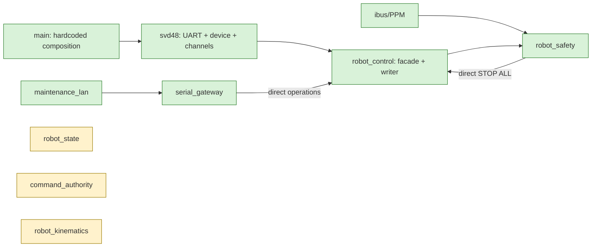

# Migration map

## Baseline and scope

Inventory captured from `ce5f1e2e5b4e784b0b877366be6f68b6778f14d1` on
2026-08-02. This first change performs Phase 0 and initial Phase 1 documentation;
it does **not** claim that planned destinations are implemented. Status values are
`active`, `dormant`, `partial`, and `planned`.

## Component disposition

| Current component | Classification | Current responsibilities / problems | Destination and migration strategy | Status |
| --- | --- | --- | --- | --- |
| `main` | Must be divided | Boot, lifecycle, pins, topology and service wiring; hardcoded board/device data | Retain as composition root; extract board and robot profiles before changing behavior | Active → planned |
| `svd48_protocol` | Reusable unchanged | Pure framing, CRC and response validation; correctly hardware-independent | Keep as protocol library and preserve reference tests | Active |
| `svd48` | Must be divided | UART/RS485 ownership, protocol, fixed two-drive/four-motor mapping, polling, telemetry and device commands | Extract transport port; model each SVD48 device with M1/M2 channel adapters; preserve wire behavior | Active → planned |
| `robot_control` | Must be divided | Concrete SVD48/PWM facade, kinematics, direct actuation, maintenance and telemetry | Characterize, then move behavior into endpoint adapters, motion controller, coordinator, maintenance and telemetry services | Active → planned |
| `robot_safety` | Must be divided | Reads RC/SVD48 through concrete facade, evaluates two conditions and directly stops | Split monitors, health aggregation and supervisor; supervisor requests coordinator stop | Active → planned |
| `serial_gateway` | Must be divided | UART task, parsing, dispatch, formatting and knowledge of all concrete services | Preserve framing/results; separate transport, parser, dispatcher and operation/maintenance/config/OTA handlers | Active → partial |
| `maintenance_lan` | Reusable with adaptation | Authenticated UDP JSON wrapper delegates ASCII commands; broad bench allowlist has no lease | External adapter into dispatcher; motion follows authority path and register writes require maintenance state | Active → planned |
| `control_lan` | Reusable with adaptation | Sequenced protocol but dormant and not integrated | External command adapter after authority/coordinator contracts exist | Dormant |
| `ibus_receiver` | Reusable with adaptation | ESP-IDF acquisition and RC snapshots | Retain hardware adapter; publish semantic commands through command-input port | Active → planned |
| `ppm_decoder_model` | Reusable unchanged | Pure pulse/frame decoding | Keep in domain-support library with current host tests | Active |
| `ppm_decoder` | Reusable with adaptation | ESP-IDF GPIO/timing acquisition | Keep as platform adapter below receiver | Active |
| `robot_kinematics` | Reusable with adaptation | Pure differential inverse kinematics and explicit units/limits | Retain as differential strategy; add strategy port later without driver dependencies | Dormant foundation |
| `robot_state_model` | Reusable with adaptation | Pure state, inhibits, guards and requested actions | Retain in domain; reconcile state names/policy with approved profile safety rules | Dormant foundation |
| `robot_state_service` | Reusable with adaptation | Mutex-protected state model and inhibit source slots | Integrate as application service; keep model independent of FreeRTOS | Dormant foundation |
| `command_authority_model` | Reusable with adaptation | Pure priority/lease/TTL/deadman/sequence model | Extend only after precedence decisions; place behind command-routing service | Dormant foundation |
| `config_manager` | Reusable with adaptation | NVS credentials and runtime network/OTA settings | Keep runtime settings separate from immutable build profile | Active |
| `wifi_manager` | Reusable without changes | Low-priority station lifecycle | Keep external/platform service; no control-task dependency | Active |
| `ota_manager` | Reusable with adaptation | Manifest/download/rollback lifecycle; safe check supplied externally | Replace concrete robot facade with state/stop preparation port | Active → planned |
| `ota_announce` | Reusable with adaptation | Authenticated UDP OTA requests; directly carries robot facade | External adapter into OTA application port | Active → planned |

## Real baseline flow

Green nodes are implemented/active; amber nodes are implemented but dormant.
The baseline diagram predates Iteration 2; the implemented profile, capability ports and coordinator are described below and do not alter the dormant state/authority nodes.

## Dependency problems to remove incrementally

1. `robot_control -> svd48` and ESP-IDF PWM binds application behavior to devices.
2. `robot_safety -> robot_control + ibus_receiver` combines observation, policy and output.
3. `serial_gateway -> concrete services` makes transport/grammar an application facade.
4. `ota_announce -> robot_control` couples a network callback path to actuator policy.
5. `main -> pins/topology` prevents safe build profile selection and validation.

Each dependency remains until its replacement has host tests and the active call
path is migrated. Functional code is not deleted merely because a target exists.

## Iteration 2 characterization and migration (2026-08-02)

The individual write is `robot_control_set_motor_speed(handle, motor, int16_t rpm)`;
the global stop was `robot_control_stop_all(handle)`. Servo writes are private
`steering_set_angle()` calls during initialization and `MOVE_VEL`. RPM remains signed
`int16_t`, externally limited to `±15 RPM`; logical motor indices remain `0..3`.

Migrated call sites are boot `STOP ALL`, serial `SET_SPEED n rpm`, serial `STOP ALL`,
and the repeated `robot_safety` stop. `maintenance_lan` reuses
`serial_gateway_execute_command`, so its allowed `SET_SPEED`/`STOP ALL` follows the
same route. The coordinator is the single writer **for these migrated operational
paths**, not globally.

Legacy hardware-changing paths still active are serial `ENABLE n|ALL` (including
speed zero), `STOP n`, `CLEAR_FAULT n|ALL`, `MOVE_VEL`, confirmed register writes,
SVD48 save/gear/identify/config helpers, OTA preparation, and private servo centering
and steering inside `robot_control`. Read-only facade operations are max-RPM, motor
telemetry, last-motion, OTA-safe query, trace query and register reads; polling and
trace mutation are operational but do not command actuator setpoints.

`main` now selects and validates `current_robot_profile`; pins, UART selection, drive
IDs, endpoint/channel association, servo configuration, geometry and limits live in
that immutable C profile. `robot_composition` builds four velocity/stoppable traction
endpoints through the transitional legacy adapter. SVD48 wire protocol, retries,
timeouts and polling were not changed.
