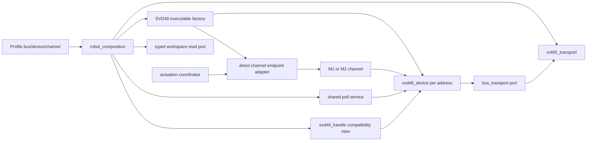

# SVD48 integration

## Hardware and profile boundary

Iteration 4 models each Fulling SVD48 as one physical two-channel device at one RS485
address. M1 and M2 are explicit channel views of that device, not independent UART
controllers. Profiles bind stable endpoints to `device_id + channel` and the
application compatibility edge assigns logical motor indices in endpoint order.

The SVD48 bus used by the traction build profiles is:

| Setting | Value |
| --- | --- |
| UART | UART2 |
| TX / RX | GPIO17 / GPIO16 |
| Baud | 115200 |
| Response timeout / configured retries | 100 ms / 2 |
| Poll period / stale threshold | 30 ms / 1000 ms |
| Direction | External auto-direction converter; ESP-IDF half-duplex mode disabled |

`current_robot` configures two devices and four endpoints:

| Legacy index | Endpoint | Address | Channel |
| ---: | --- | ---: | --- |
| 0 | `traction_front_left` | 1 | M1 |
| 1 | `traction_front_right` | 1 | M2 |
| 2 | `traction_rear_left` | 2 | M1 |
| 3 | `traction_rear_right` | 2 | M2 |

`bench_single_svd48_motor` configures one device at address 1 and only endpoint
`bench_motor` on M1. It exposes legacy index `0`; index `1` is invalid. The profile has
no application geometry, so `SET_SPEED 0`, `STOP 0` and `STOP ALL` are routable while
`MOVE_VEL` is unsupported. The absent second controller and M2 endpoint are not
reported as failed hardware.

`rafa` configures one device at address 2 and exposes both channels as
`rafa_traction_m1` and `rafa_traction_m2`. Its source profile maps M1 to
right/`+1` and M2 to left/`-1`, with direct drive and `-40..40 RPM` endpoint limits.
It uses a 0.20 m wheel radius, 1.52 m lateral centre-to-centre track, `0.8 m/s`
maximum forward speed, `pi/6 rad/s` maximum yaw, and a 300 ms control TTL.
Differential v1 consumes track width and wheel radius, not wheelbase. These are source
configuration values for candidate build 35, not evidence of deployed wheel motion or
floor qualification. The profile declares the controller as required, so an unplugged
board truthfully reports offline/stale observations.

Profiles are immutable C selected by Kconfig. There is no supported runtime JSON/YAML
loader or mutable topology override in NVS.

## Implemented layers

- `bus_transport` defines portable serialized request/response transactions and
  statistics.
- One `rs485_transport` owns the UART, bus mutex and separate statistics mutex. Every
  configured SVD48 device on that bus shares the same transport port.
- One `svd48_device` owns an address, two channels, communication diagnostics and
  observation snapshots. It has no UART or `robot_control` dependency.
- `svd48_poll_service` schedules up to four configured physical devices with
  independent deadlines and error/partial backoff measured after each completed poll;
  one priority-8 polling task drives the service.
- `svd48_channel_endpoint_adapter` implements the direct velocity/stop endpoint used
  by the coordinator.
- `svd48_workspace_port` projects configured device identity, physical M1/M2 endpoint
  bindings and cached snapshots to maintenance clients. It contains no write method;
  typed bench writes resolve the binding and use the application/coordinator port.
- The executable factory registry contains SVD48/RS485 only. Other driver IDs in the
  profile schema are not runtime factories.
- The attached legacy `svd48_handle_t` view preserves maintenance, OTA, safety
  telemetry and other unmigrated callers without owning another UART or poll task.

## Wire protocol

The protocol implements holding-register read (`0x03`), single-register write
(`0x06`) and multiple-register write (`0x10`). CRC uses initialization `0xFFFF` and
polynomial `0xA001`; this established device contract appends the computed high byte
then low byte. Keep golden vectors synchronized with the proven firmware protocol.
Device addresses are limited to Modbus unicast IDs `1..247`; read builders also
enforce the 125-register protocol maximum and 16-bit register-range bounds.

Responses are checked for slave address, function, declared length, exception frames
and CRC. Reads and typed channel operations follow their explicit bounded retry
policy. Generic single- and multiple-register maintenance writes are not retried
after an ambiguous transaction result because the first request may already have
changed controller state.

The Engineering Console NEXT-2 adapter uses the existing `READ_REG` (one or two
words), `WRITE_REG`/`WRITE_REGS` and independent readback contracts; no new firmware
parameter command was added. The reviewed V2.0 manual marks motor inductance,
resistance and loop gains as two-register floats. Read-only Rafa comparison against a
trusted SV-Config export qualified these as IEEE-754 binary32 with the high 16-bit word
at the lower register. This is evidence for the typed Console codec, not permission to
tune PID or proof of persistence. No physical write or save was used for qualification.

Hall calibration is intentionally outside that generic parameter workflow. The
reviewed manual maps M1/M2 trigger registers to `0x5600`/`0x5601` (write `1`) and
status registers to `0x5684`/`0x5685` (`0=SUCCESS`, `1=CALIBRATING`, `2=FAILED`).
The firmware exposes them only through `SVD48_HALL_CALIBRATE`; it performs one typed,
non-retried trigger and then an independent status read. Acknowledgement or status
availability is not a mechanical calibration result and does not send a configuration
save command. The firmware requires the selected healthy channel to report `STOPPED`;
`HOLD 0` remains enabled and is rejected rather than being treated as stopped.

For Hall diagnosis, each invocation also projects its bounded driver-observed `TX` and
`RX` hex frames through `SVD48_HALL_TRACE`. This includes the actual CRC generated by
the driver and any bounded status-read retry, but it is deliberately not a generic raw
RS485 terminal or authority to transmit arbitrary frames.

The shared bus lock covers one complete request/response exchange, so polling,
actuation and maintenance calls from different devices cannot interleave bytes.
Per-device state uses a separate lock and must not be confused with bus serialization.

## Channel actuation

| Purpose | M1 | M2 | Unit/value |
| --- | ---: | ---: | --- |
| Control command | `0x5300` | `0x5301` | command word |
| Given speed | `0x5304` | `0x5305` | signed raw RPM |
| Given current | `0x5308` | `0x5309` | signed 0.1 A |

Setting a channel velocity writes its bounded signed RPM target and then enables that
channel. If target or enable fails, the direct endpoint adapter requests a best-effort
channel stop. Stop first writes a zero target and then the stop control command; a
failed zero write does not suppress the stop attempt.

The workspace names these existing behaviors explicitly: `SVD48_BENCH_SET_SPEED`
uses the requested RPM; `SVD48_BENCH_SET_SPEED_PAIR` validates M1/M2 then applies
one shared target through the application coordinator; `SVD48_BENCH_HOLD` uses zero RPM while enabled; and
`SVD48_BENCH_DISABLE`/`SVD48_BENCH_STOP` use the stop/freewheel sequence. The gateway
never selects target/control registers itself. These commands are bench maintenance,
not a continuous control plane.

The gateway rejects bench set-speed/hold while continuous control is `ARMED` or
`ACTIVE`. Stop/disable remain callable. The same firmware interlock blocks SVD48
configuration writes and save operations during those two states; profiles without
continuous control and disarmed sessions retain the existing maintenance workflow.

The coordinator reaches this direct adapter for `SET_SPEED`, individual/global stop,
boot stop and safety stop. `ENABLE`, `CLEAR_FAULT`, `MOVE_VEL`, OTA preparation,
motor identification and maintenance configuration still use the compatibility
facade and are documented bypasses, not an alternate new architecture.

## Observations and units

Polling reads these paired M1/M2 observations:

| Observation | Start register | Representation |
| --- | ---: | --- |
| Status | `0x5400` | 0 stopped, 1 running |
| Motor temperature | `0x5404` | signed 0.1 C |
| MOS temperature | `0x5408` | signed 0.1 C |
| Bus voltage | `0x540C` | 0.1 V |
| Observed motor speed | `0x5410` | signed raw RPM |
| Actual current | `0x5414` | signed 0.1 A |
| Position | `0x5418` | 32-bit counts per channel |
| Error code | `0x5420` | 32-bit value per channel |

The manufacturer register table labels both given speed `0x5304/0x5305` and motor
speed `0x5410/0x5411` as RPM. The driver therefore preserves the signed raw register
value as RPM without a factor-of-ten conversion. Earlier `deciRPM` prose and names were
unsupported assumptions.

This unconfirmed observed value already feeds the legacy 5-RPM OTA/maintenance
readiness predicate and `PLATFORM_STATUS` motion indication. Those checks skip
offline/stale telemetry and are not qualified safety evidence. A separate controlled
physical test on the exact controller model/firmware must confirm the interpretation
and inform a reviewed failure policy before that dependency is accepted or expanded.
The test must be explicitly authorized, performed off the ground with independent
power cut-off and stored as an external artifact; it is not part of CI.

## Polling, freshness and health

Each fast cycle attempts position, speed and current; the periodic slow cycle also
attempts status, temperatures, bus voltage and error code. Every observation retains
independent validity, failure state and update time. Later success for current,
status or temperature does not refresh a failed speed observation.

The public snapshot exposes `valid_observations`, `failed_observations`,
`stale_observations`, per-field `observation_update_ms`, `last_poll_ms` and
`last_poll_result`. The observed speed field is `observed_speed_rpm`. Polling returns
`SVD48_DEVICE_PARTIAL` for a mixed cycle, and channel health has an explicit
`SVD48_CHANNEL_HEALTH_STALE` state.

- `OK`/complete means every observation attempted in that poll cycle succeeded.
- `PARTIAL` means communication succeeded for some observations but at least one
  required read failed. The poll service treats it as degraded/failure for backoff.
- A cycle in which every attempted read fails reports the first concrete
  timeout/busy/I/O/frame/protocol result.
- `stale` is evaluated independently per observation from its own timestamp.
- `offline` means no successful device transaction remains within the configured
  timeout. Snapshot-level `stale` means at least one configured observation is
  invalid or too old; it is deliberately more sensitive than the velocity-channel
  communication health.
- Velocity-channel communication health requires only the fast feedback set:
  position, speed and current. A stale lower-rate status, temperature, bus-voltage or
  error-code observation remains visible in `stale_observations`, but does not by
  itself report the channel as unavailable or inhibit velocity control.
- `degraded` for the velocity channel records a failure in that same fast feedback
  set while the controller remains online and its last valid feedback is fresh.
- A valid, fresh nonzero controller error code maps to fault and is not erased by a
  later unrelated read.

Velocity-channel health precedence is `OFFLINE`, fresh `FAULT`, fast-feedback
`STALE`, fast-feedback `DEGRADED`, then `HEALTHY`. Offline always wins; a fresh
nonzero error yields `FAULT` even if another field is stale, while a stale error
observation no longer yields `FAULT`. Unrelated success does not clear a fresh fault.

The active safety task still consumes the legacy telemetry projection and does not
yet turn all stale/offline/degraded required observations into motion inhibits. See
[Safety](SAFETY.md).

## Exceptions and diagnostics

Communication diagnostics distinguish timeout, busy bus, I/O error, incomplete
frame, cancellation, CRC failure, exception response, malformed response and partial
poll. The latest Modbus exception function/code and timestamp remain visible in the
channel/legacy telemetry projection. Poll backoff is per configured device; one absent
controller does not prevent other entries from being scheduled. A whole-poll guard
rejects a concurrent legacy `POLL_ONCE` with busy, so its transactions cannot
interleave a service-owned cycle or race `poll_count`.

When the physical controller address is unknown, `SVD48_PROBE <address>` provides
a narrow read-only discovery primitive over the already configured transport. Each
invocation sends one holding-register read for `0x540C..0x540D` to one Modbus
unicast address in `1..247`, uses the normal response timeout, performs no retry and
does not update configured-device health or communication counters. It never writes
an address or any other register. Host orchestration owns range scanning and evidence.
Do not diagnose a dead RS485 connection from the configured address alone: first
scan the relevant address range, repeat or review any contention/CRC/bad-response
anomaly, then inspect power, polarity, ground and termination if no valid response
is found.

Tracing is a bench diagnostic. It exposes frame bytes but must never include Wi-Fi,
maintenance or OTA credentials. High-volume trace output is not real-time safe.

## Maintenance register access

Generic device writes reject ranges used for runtime actuation so maintenance cannot
bypass the typed channel operations by writing target/control registers through the
new device API. Confirmed maintenance access remains available for non-actuation
registers through the legacy command surface.

Configuration/diagnostic helpers use `0x2201..0x2203`, `0x5018..0x5019`,
`0x502C..0x502D`, `0x5620..0x5621`, `0x5684..0x5685` and `0x5688..0x568D`.
The reviewed manual classifies `0x2202` (motor sprocket teeth) and `0x2203` (wheel
sprocket teeth) as controller-wide `uint16` configuration, range `1..32767`. Rafa's
currently observed controller variant returns `ERR:0x108` for both reads; clients must
present that as `UNAVAILABLE` with the controller detail preserved, never as zero or an
inferred value. Hall installation registers `0x5620/0x5621` encode `0=120 degrees`,
`1=60 degrees`; `0x5688/0x5689` are Hall status, and `0x568C/0x568D` are signed Hall
angles in degrees. `CONFIRM` acknowledges operator intent but is not authorization,
rollback or proof that an address is safe. Do not extrapolate undocumented registers
from adjacency.

For any write campaign:

1. Keep the mechanism unloaded and preserve an independent power disconnect.
2. Read and archive original values outside the repository.
3. Verify device address, channel, controller model/firmware and register meaning.
4. Change the smallest set, read it back and power-cycle only when required.
5. Confirm stop behavior and telemetry before any explicitly authorized low-speed test.
6. Restore the known baseline if any observation differs from expectation.

`APPLY_PY6514_CONFIG` remains a hardware-specific bench helper, not a universal
production profile.

## Legacy compatibility limit

The attached wrapper maps profile endpoint order to the external logical motor API and
accepts at most four channel bindings. Composition must reject excess bindings with a
`LEGACY_BINDING_LIMIT` diagnostic. This limit preserves `0..3` compatibility for the
current robot; it is not a logical-motor limit of `svd48_device` or M1/M2 channels.
The poll service has a separate four-physical-device static capacity.

The wrapper remains until telemetry, trace, maintenance, OTA and safety callers move
to typed device/application ports. It must not create a second polling task when it is
attached to composed devices.

## Vendor references

Vendor PDFs and downloaded product pages are intentionally not stored here. Archive
the exact controller manual title, revision, checksum and retrieval date in the
company artifact system. A mutable product URL is not a permanent specification.
